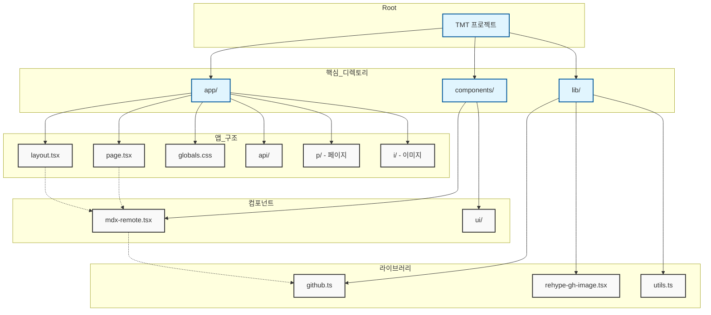

# 코드베이스 구조와 흐름도



## 흐름 설명

1. **진입점**:

   - Next.js와 TypeScript를 기반으로 한 애플리케이션
   - 루트 디렉토리에 핵심 설정 파일들이 위치

2. **주요 구조**:

   - `/app`: Next.js 13+ App Router 기반의 핵심 애플리케이션 파일들
   - `/components`: 재사용 가능한 UI 컴포넌트들
   - `/lib`: 유틸리티 함수와 공유 코드

3. **App 디렉토리 구조**:

   - `layout.tsx`: 모든 페이지를 감싸는 루트 레이아웃 컴포넌트
   - `page.tsx`: 메인 랜딩 페이지 컴포넌트
   - `globals.css`: 전역 스타일 정의
   - `/api`: API 라우트 정의
   - `/p`: 페이지 라우트
   - `/i`: 이미지 에셋 저장소

4. **컴포넌트 구조**:

   - `mdx-remote.tsx`: MDX 콘텐츠 렌더링 컴포넌트
   - `/ui`: UI 컴포넌트 라이브러리

5. **라이브러리 유틸리티**:

   - `github.ts`: GitHub API 통합 및 유틸리티
   - `rehype-gh-image.tsx`: MDX 콘텐츠용 이미지 처리
   - `utils.ts`: 일반 유틸리티 함수

6. **데이터 흐름**:
   - 페이지와 레이아웃은 components 디렉토리의 컴포넌트들을 사용
   - 컴포넌트들은 lib 디렉토리의 유틸리티를 활용
   - MDX 컴포넌트는 GitHub 유틸리티와 상호작용하여 콘텐츠 처리

```

이 다이어그램은 코드베이스의 전체적인 구조와 각 컴포넌트 간의 관계를 시각적으로 보여줍니다. 특히:

1. 프로젝트의 계층 구조
2. 주요 디렉토리와 그 내용물
3. 다양한 컴포넌트 간의 관계
4. 데이터와 기능의 흐름

을 한눈에 파악할 수 있도록 구성되어 있습니다.
```
